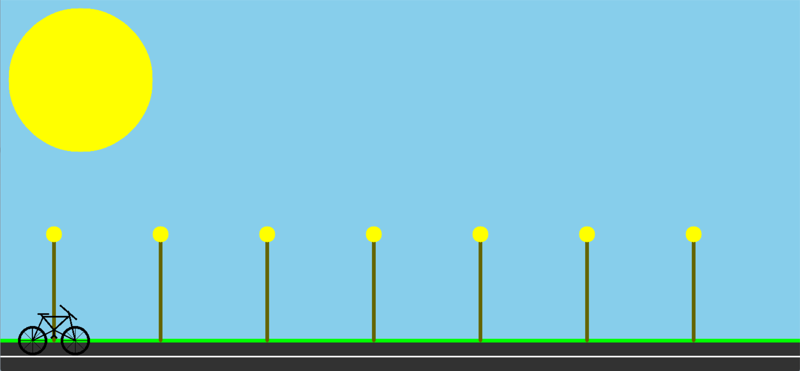

# Computer-Graphics

# 🚴 Moving Cycle Animation using OpenCV 

This is a **Computer Graphics project** developed as part of coursework using **Python and OpenCV**. The project simulates a moving cycle along a road with additional environmental elements like street lights and sky, using basic 2D graphics operations.

## 🎯 Project Overview

The goal of this project is to visually simulate a 2D scene where a **cycle moves continuously along a road**, creating an animated effect. The simulation is built using OpenCV’s drawing and image manipulation functions in Python.

### ✨ Features

- 🛣️ Road with lane markings  
- 🚲 Moving bicycle (cycle)  
- 🌃 Sky and street lights  
- 🚦 Real-time animation using OpenCV's GUI functions  
- 🌀 Smooth movement using simple logic

## 🧰 Technologies Used

| Technology | Purpose |
|-----------|---------|
| `Python` | Programming language |
| `OpenCV` | Rendering and animation |
| `NumPy` | Matrix/image manipulation |


## 📸 Screenshots



## 🚀 How to Run

### Prerequisites

- Python 3.x
- OpenCV installed (`pip install opencv-python`)
- NumPy (`pip install numpy`)

### Running the project

```bash
cd computer-graphics/moving-cycle/
python cycle.py


